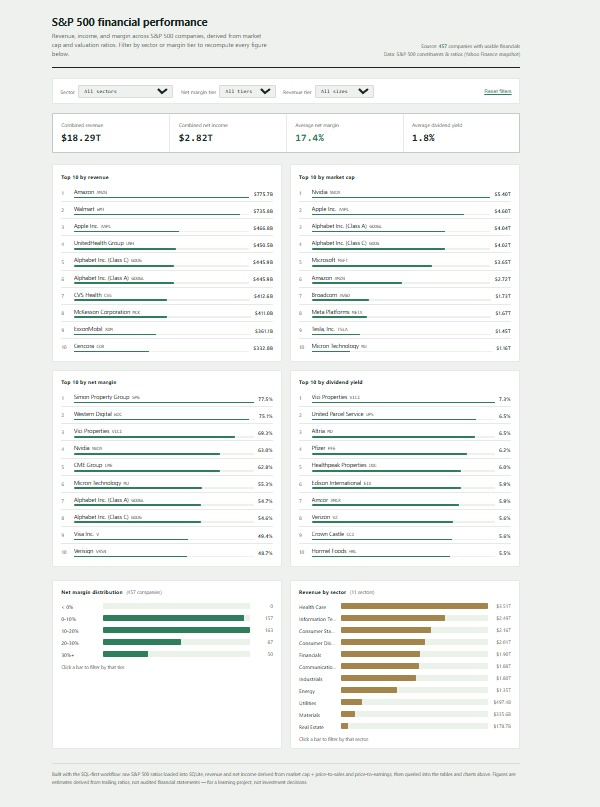

# S&P 500 Financial Performance Dashboard

A self-contained, SQL-first financial dashboard: real S&P 500 company data,
cleaned and derived with SQL, rendered as an interactive HTML dashboard with
no server and no dependencies.

**Live file:** [dashboard.html](dashboard.html) — open it directly in a browser.


<!-- Upload your own screenshot of dashboard.html to the repo root as screenshot.png before pushing. -->

## Data

Two public CSVs from the [`datasets` org on GitHub](https://github.com/datasets):

- [`s-and-p-500-companies-financials`](https://github.com/datasets/s-and-p-500-companies-financials) —
  price, P/E, dividend yield, EPS, market cap, EBITDA, price/sales, price/book
  for each S&P 500 company (source: Yahoo Finance snapshot).
- [`s-and-p-500-companies`](https://github.com/datasets/s-and-p-500-companies) —
  GICS sector and sub-industry for each company.

Both are checked in as CSVs in the repo root so the project runs with no downloads.

Neither file reports **revenue** or **net income** directly — but both fall
out of ratios that *are* reported, since market cap, price/sales, and
price/earnings all share the same underlying share count:

```
revenue    = market_cap / price_to_sales
net_income = market_cap / price_to_earnings
net_margin = net_income / revenue
```

This makes the project a good exercise in **derived metrics**: the dashboard
isn't just displaying columns, it's computing the numbers it displays.

> These are estimates from trailing valuation ratios, not audited financial
> statements. Good for practicing the workflow, not for investment decisions.

## Business Questions

- Which companies generate the highest revenue and net income?
- Which companies have the strongest net margin?
- How does financial performance vary by sector?
- Which companies pay the highest dividend yield?

## KPIs / Fields

- Combined Revenue
- Combined Net Income
- Avg Net Margin %
- Avg Dividend Yield %
- Top 10 by Revenue / Market Cap / Net Margin / Dividend Yield
- Net Margin Distribution (tiered)
- Revenue by Sector

## What to Build

An executive financial dashboard with ranked leaderboards (not plain bar
charts — numbered rows with an inline proportional bar), a net margin
distribution, and a revenue-by-sector breakdown, all recomputing live from
two filters: **sector** and **net margin tier**.

## Project Structure

```
constituents.csv               raw CSV: sector per company
constituents-financials.csv    raw CSV: price, P/E, market cap, etc.
build.py                       SQL-first pipeline: loads, cleans, derives, exports
by_sector.csv                  } 
companies_full.csv             }
margin_distribution.csv        }  one CSV per analysis query
summary.csv                    }  (generated by build.py)
top10_*.csv                    }
dashboard_template.html        dashboard markup/CSS/JS, with a data placeholder
build_html.py                  injects companies_full.csv into the template
dashboard.html                 the finished, self-contained dashboard (generated)
screenshot.png                 preview image shown above (add your own)
```

## Rebuilding It Yourself

Everything here was generated by a two-step pipeline so the whole thing is
reproducible from the raw CSVs:

```bash
python3 build.py        # loads constituents*.csv -> financial.db -> *.csv result files
python3 build_html.py   # embeds companies_full.csv into dashboard.html
```

`build.py` is deliberately written as a set of named, readable SQL queries —
read it top to bottom and you can see exactly how every number on the
dashboard was produced. That's the "SQL-first" part: no number appears on
the dashboard that you can't trace back to a query.

## Build Your Own Version with Claude (SQL-first)

If you want to practice this workflow rather than just read the finished
code, work through it with Claude Code one prompt at a time:

**1. Get the data**
Both CSVs are already checked into the repo root. If you want fresher numbers,
re-download them from the source links above.

**2. Load it into a local SQLite database**
> "Load `constituents-financials.csv` and `constituents.csv` into
> a new SQLite database called `financial.db`. Some numeric columns may be
> blank for a handful of companies — load everything as text for now, we'll
> clean it with SQL next."

**3. Explore and clean the data**
> "Show me the schema and 5 sample rows of each table."

> "Join the two tables on Symbol. Add derived numeric columns: `revenue`
> (market cap ÷ price/sales) and `net_income` (market cap ÷ price/earnings).
> Then add `net_margin` (net_income ÷ revenue × 100)."

**4. Ask one SQL question at a time**
> "Write and run a SQL query: combined revenue, combined net income, average
> net margin, and average dividend yield across all companies with valid
> numbers."

> "Write and run a SQL query: top 10 companies by revenue, sorted highest to
> lowest."

> "Write and run a SQL query: top 10 companies by net margin, restricted to
> companies with revenue over $1B, sorted highest to lowest."

> "Write and run a SQL query: count of companies bucketed into net margin
> tiers (<0%, 0-10%, 10-20%, 20-30%, 30%+)."

Ask **"explain this query"** any time a result surprises you.

**5. Save your results**
> "Save each of those query results as its own CSV file in a `results/`
> folder."

**6. Build the dashboard**
> "Using the CSV files in `results/`, build a single self-contained
> `dashboard.html`: filter dropdowns for sector and net margin tier; KPI
> cards for combined revenue, combined income, avg net margin, and avg
> dividend yield; ranked leaderboards (numbered rows with inline
> proportional bars, not bar charts) for top 10 by revenue, market cap, net
> margin, and dividend yield; plus a net margin distribution and a
> revenue-by-sector breakdown — recomputing when a filter changes, one
> accent color, no dark mode."

Compare your version against [dashboard.html](dashboard.html) once you're
happy with it.

## Tool

No BI tool required — pure HTML/CSS/JS. If you'd rather build this in
Tableau Public or Power BI, point either tool at the CSVs in `results/`
after running `build.py`.
