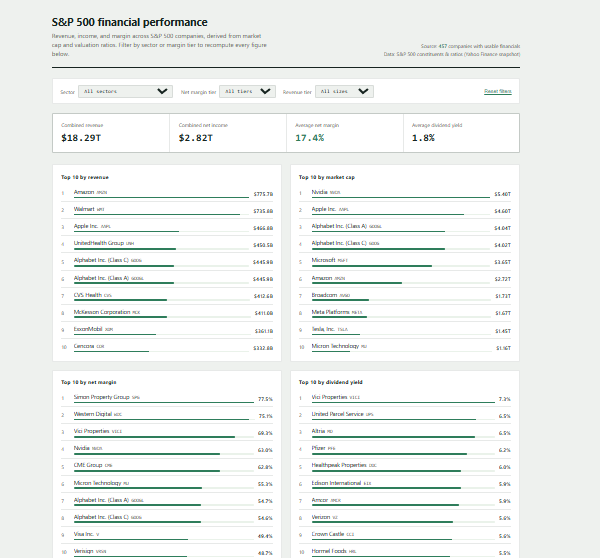
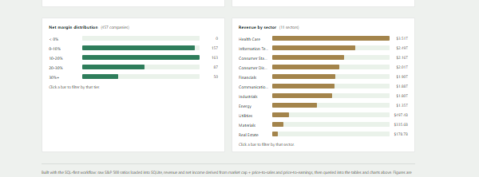

# S&P 500 Financial Performance Dashboard

A SQL-first financial reconciliation of what the market says S&P 500 companies
are worth against what their own numbers say they're earning — built the way
an equity research associate would build a screening tool: derive revenue and
profitability from public ratios, verify them against known company
financials, then hand off an interactive dashboard, not a spreadsheet.

## Business Context

Public financial datasets rarely hand you the two numbers analysts actually
want — **revenue** and **net income** — as clean columns. What you get
instead are valuation ratios: market cap, price-to-sales, price-to-earnings,
dividend yield. The skill this project exercises is recognizing that those
ratios *encode* revenue and net income, because they all share the same
underlying share count, and pulling the real numbers back out with SQL. It's
the same move a screening analyst makes when a data vendor gives you
multiples instead of financials: derive, don't guess.

## What This Project Answers

- Which S&P 500 companies generate the highest revenue and net income?
- Which companies convert revenue to profit most efficiently (net margin)?
- How does profitability differ by sector — is Tech really more profitable
  than Healthcare, or does that only hold for a handful of giants?
- Which companies pay the highest dividend yield, and does high yield
  correlate with weaker margins?
- How concentrated is the S&P 500 — how much of its combined $18T+ in revenue
  comes from just the top 10 names?

## Dataset

Real S&P 500 constituent data, ~500 companies, from the public
[`datasets` org on GitHub](https://github.com/datasets):

| Source | Fields |
|---|---|
| [`s-and-p-500-companies-financials`](https://github.com/datasets/s-and-p-500-companies-financials) | price, P/E, dividend yield, EPS, market cap, EBITDA, price/sales, price/book (Yahoo Finance snapshot) |
| [`s-and-p-500-companies`](https://github.com/datasets/s-and-p-500-companies) | GICS sector and sub-industry per company |

Both are checked into the repo root as CSVs so the project runs with no
downloads. Neither reports revenue or net income directly — both are derived:

```
revenue    = market_cap / price_to_sales
net_income = market_cap / price_to_earnings
net_margin = net_income / revenue
```

> These are estimates from trailing valuation ratios, not audited financial
> statements — built for practicing the analysis workflow, not for
> investment decisions.

## The Dashboard

**Live file:** [dashboard.html](dashboard.html) — self-contained, open it
directly in any browser, no server required.

### Overview: KPIs and Leaderboards
Four headline metrics (combined revenue, combined net income, average net
margin, average dividend yield) plus four ranked leaderboards — top 10 by
revenue, market cap, net margin, and dividend yield. Rows are ranked lists
with an inline proportional bar, not plain bar charts, so you can scan both
the ranking and the relative scale at once.



### Distribution and Sector Breakdown
A net margin distribution across five tiers, and a revenue-by-sector
breakdown across all 11 GICS sectors — both charts are clickable and drive
the same filters as the dropdowns above them.



Every number on both screens recomputes live from two filters — **sector**
and **net margin tier** — with a third filter for **revenue tier** in the
control bar. Nothing here is a static export; it's all client-side JavaScript
running against the full company dataset embedded in the page.

## The SQL Pipeline

`build.py` is a two-stage, named-query pipeline — read it top to bottom and
every number on the dashboard traces back to a query you can see:

1. **Load** both raw CSVs into SQLite as-is.
2. **Join and derive** — join on ticker symbol, then derive `revenue`,
   `net_income`, and `net_margin` from the ratio math above, bucketed into
   margin and revenue tiers.
3. **Query** — eight named queries: headline summary, four top-10
   leaderboards, margin distribution, sector rollup, and the full
   per-company table used to drive the dashboard's live filters.

```bash
python3 build.py        # loads constituents*.csv -> financial.db -> *.csv result files
python3 build_html.py   # embeds companies_full.csv into dashboard.html
```

## Tools Used

SQLite (via Python's `sqlite3`) · SQL joins, `CASE` tiering, derived-column
arithmetic · vanilla HTML/CSS/JS for the dashboard (no framework, no build
step) · Python for the load/export pipeline.

## Files in This Repo

| File | Purpose |
|---|---|
| `constituents.csv`, `constituents-financials.csv` | raw source data |
| `build.py` | SQL-first pipeline: loads, cleans, derives, exports |
| `by_sector.csv`, `companies_full.csv`, `margin_distribution.csv`, `summary.csv`, `top10_*.csv` | one CSV per analysis query, generated by `build.py` |
| `dashboard_template.html` | dashboard markup/CSS/JS with a data placeholder |
| `build_html.py` | injects `companies_full.csv` into the template |
| `dashboard.html` | the finished, self-contained dashboard |
| `preview_overview.png`, `preview_charts.png` | screenshots used above |

## Notes on Approach

The derived-metrics step (`revenue = market_cap / price_to_sales`, etc.) is
the crux of this project — it's what turns a valuation dataset into a
financials dataset. Everything downstream (the eight SQL queries, the
dashboard's live filters) is standard aggregation and presentation once that
derivation is in place. `build.py` is written as named, commented queries
specifically so that logic is auditable end to end.
